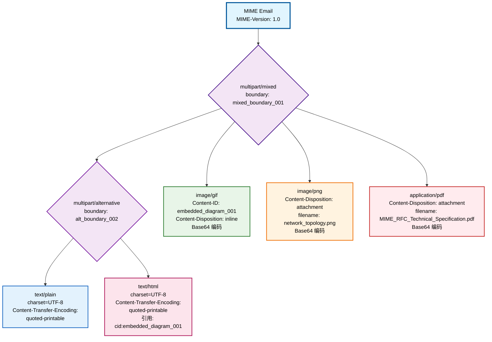
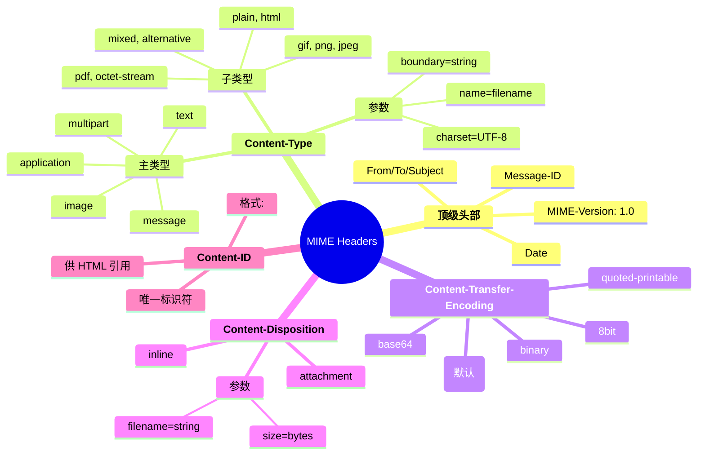
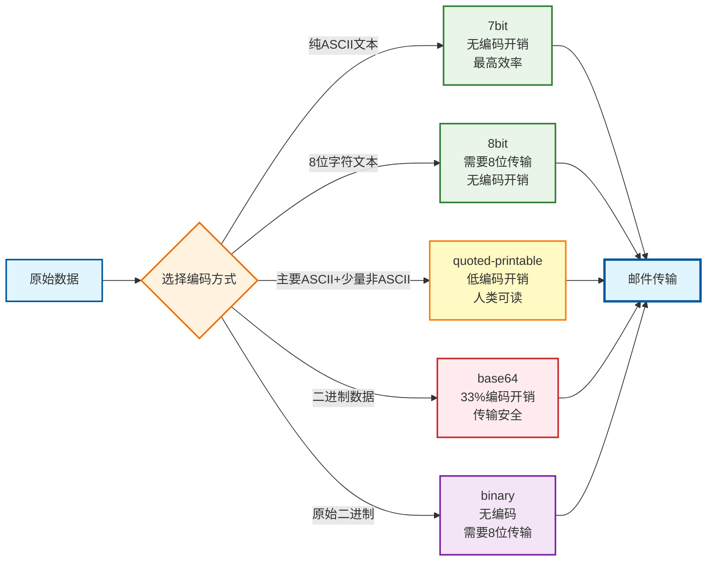

# MIME 结构可视化图表

## 1. Mermaid 图表 - MIME 层次结构

### 1.1 完整 MIME 结构流程图



### 1.2 MIME 头部字段结构图



### 1.3 编码机制对比图



## 2. SVG 专业学术海报图表

### 2.1 A0 尺寸适配的 MIME 架构图

```svg
<svg width="841mm" height="594mm" viewBox="0 0 3370 2380" xmlns="http://www.w3.org/2000/svg">
  <defs>
    <style>
      .title-text { font-family: 'Arial', sans-serif; font-size: 48px; font-weight: bold; fill: #1a237e; }
      .header-text { font-family: 'Arial', sans-serif; font-size: 32px; font-weight: bold; fill: #283593; }
      .body-text { font-family: 'Arial', sans-serif; font-size: 24px; fill: #424242; }
      .small-text { font-family: 'Arial', sans-serif; font-size: 18px; fill: #616161; }
      .mime-container { fill: #e8eaf6; stroke: #3f51b5; stroke-width: 4; rx: 15; }
      .multipart-container { fill: #f3e5f5; stroke: #9c27b0; stroke-width: 3; rx: 12; }
      .text-part { fill: #e3f2fd; stroke: #2196f3; stroke-width: 2; rx: 8; }
      .image-part { fill: #e8f5e8; stroke: #4caf50; stroke-width: 2; rx: 8; }
      .attachment-part { fill: #fff3e0; stroke: #ff9800; stroke-width: 2; rx: 8; }
      .arrow { stroke: #37474f; stroke-width: 3; marker-end: url(#arrowhead); }
    </style>
    <marker id="arrowhead" markerWidth="10" markerHeight="7" refX="9" refY="3.5" orient="auto">
      <polygon points="0 0, 10 3.5, 0 7" fill="#37474f" />
    </marker>
  </defs>
  
  <!-- 背景 -->
  <rect width="3370" height="2380" fill="#fafafa"/>
  
  <!-- 标题 -->
  <text x="1685" y="80" text-anchor="middle" class="title-text">MIME (多用途互联网邮件扩展) 结构图</text>
  <text x="1685" y="130" text-anchor="middle" class="body-text">基于 RFC 2045-2049 标准的完整实现架构</text>
  
  <!-- 主MIME容器 -->
  <rect x="100" y="200" width="3170" height="2080" class="mime-container"/>
  <text x="150" y="240" class="header-text">MIME Email Container</text>
  <text x="150" y="280" class="body-text">MIME-Version: 1.0</text>
  <text x="150" y="310" class="body-text">Content-Type: multipart/mixed; boundary="=_mixed_boundary_001"</text>
  
  <!-- multipart/mixed 顶级容器 -->
  <rect x="200" y="380" width="2970" height="1800" class="multipart-container"/>
  <text x="250" y="420" class="header-text">multipart/mixed (顶级容器)</text>
  
  <!-- multipart/alternative 容器 -->
  <rect x="300" y="480" width="800" height="600" class="multipart-container"/>
  <text x="350" y="520" class="body-text">multipart/alternative</text>
  <text x="350" y="550" class="small-text">boundary="=_alt_boundary_002"</text>
  
  <!-- text/plain 部分 -->
  <rect x="350" y="600" width="300" height="200" class="text-part"/>
  <text x="370" y="630" class="body-text">text/plain</text>
  <text x="370" y="660" class="small-text">charset=UTF-8</text>
  <text x="370" y="685" class="small-text">quoted-printable</text>
  <text x="370" y="710" class="small-text">中文内容编码</text>
  <text x="370" y="735" class="small-text">人类可读格式</text>
  
  <!-- text/html 部分 -->
  <rect x="700" y="600" width="300" height="200" class="text-part"/>
  <text x="720" y="630" class="body-text">text/html</text>
  <text x="720" y="660" class="small-text">charset=UTF-8</text>
  <text x="720" y="685" class="small-text">quoted-printable</text>
  <text x="720" y="710" class="small-text">HTML + CSS</text>
  <text x="720" y="735" class="small-text">引用: cid:embedded_*</text>
  
  <!-- 嵌入图像 -->
  <rect x="1200" y="480" width="400" height="300" class="image-part"/>
  <text x="1220" y="520" class="body-text">image/gif (嵌入)</text>
  <text x="1220" y="550" class="small-text">Content-ID: &lt;embedded_diagram_001&gt;</text>
  <text x="1220" y="575" class="small-text">Content-Disposition: inline</text>
  <text x="1220" y="600" class="small-text">Content-Transfer-Encoding: base64</text>
  <text x="1220" y="625" class="small-text">filename="mime_structure_diagram.gif"</text>
  <text x="1220" y="665" class="small-text">用途: HTML 内联显示</text>
  <text x="1220" y="690" class="small-text">二进制数据 → Base64 编码</text>
  <text x="1220" y="715" class="small-text">33% 编码开销</text>
  
  <!-- PNG 附件 -->
  <rect x="1700" y="480" width="400" height="300" class="attachment-part"/>
  <text x="1720" y="520" class="body-text">image/png (附件)</text>
  <text x="1720" y="550" class="small-text">Content-Disposition: attachment</text>
  <text x="1720" y="575" class="small-text">Content-Transfer-Encoding: base64</text>
  <text x="1720" y="600" class="small-text">filename="network_topology.png"</text>
  <text x="1720" y="640" class="small-text">用途: 下载保存</text>
  <text x="1720" y="665" class="small-text">PNG 格式图像</text>
  <text x="1720" y="690" class="small-text">无损压缩</text>
  
  <!-- PDF 附件 -->
  <rect x="2200" y="480" width="400" height="300" class="attachment-part"/>
  <text x="2220" y="520" class="body-text">application/pdf</text>
  <text x="2220" y="550" class="small-text">Content-Disposition: attachment</text>
  <text x="2220" y="575" class="small-text">Content-Transfer-Encoding: base64</text>
  <text x="2220" y="600" class="small-text">filename="MIME_RFC_Technical_</text>
  <text x="2220" y="625" class="small-text">Specification.pdf"</text>
  <text x="2220" y="665" class="small-text">用途: 技术文档</text>
  <text x="2220" y="690" class="small-text">二进制文档格式</text>
  
  <!-- 连接线 -->
  <line x1="700" y1="420" x2="700" y2="480" class="arrow"/>
  <line x1="700" y1="520" x2="500" y2="600" class="arrow"/>
  <line x1="700" y1="520" x2="850" y2="600" class="arrow"/>
  
  <line x1="1100" y1="420" x2="1400" y2="480" class="arrow"/>
  <line x1="1600" y1="420" x2="1900" y2="480" class="arrow"/>
  <line x1="2100" y1="420" x2="2400" y2="480" class="arrow"/>
  
  <!-- HTML 引用线 -->
  <line x1="1000" y1="700" x2="1200" y2="630" stroke="#e91e63" stroke-width="2" stroke-dasharray="10,5"/>
  <text x="1050" y="650" class="small-text" fill="#e91e63">cid: 引用</text>
  
  <!-- 编码方式说明区域 -->
  <rect x="300" y="1200" width="2700" height="600" fill="#f5f5f5" stroke="#9e9e9e" stroke-width="2" rx="10"/>
  <text x="350" y="1240" class="header-text">Content-Transfer-Encoding 编码方式对比</text>
  
  <!-- 编码方式表格 -->
  <rect x="350" y="1280" width="500" height="120" fill="#e3f2fd" stroke="#2196f3" stroke-width="1"/>
  <text x="370" y="1310" class="body-text">7bit (默认)</text>
  <text x="370" y="1335" class="small-text">• 纯 ASCII 文本</text>
  <text x="370" y="1355" class="small-text">• 无编码开销</text>
  <text x="370" y="1375" class="small-text">• 最高传输效率</text>
  
  <rect x="900" y="1280" width="500" height="120" fill="#fff3e0" stroke="#ff9800" stroke-width="1"/>
  <text x="920" y="1310" class="body-text">quoted-printable</text>
  <text x="920" y="1335" class="small-text">• 主要 ASCII + 少量非 ASCII</text>
  <text x="920" y="1355" class="small-text">• 低编码开销 (~3-10%)</text>
  <text x="920" y="1375" class="small-text">• 人类可读，适合文本</text>
  
  <rect x="1450" y="1280" width="500" height="120" fill="#ffebee" stroke="#f44336" stroke-width="1"/>
  <text x="1470" y="1310" class="body-text">base64</text>
  <text x="1470" y="1335" class="small-text">• 二进制数据</text>
  <text x="1470" y="1355" class="small-text">• 33% 编码开销</text>
  <text x="1470" y="1375" class="small-text">• 传输安全，适合媒体文件</text>
  
  <rect x="2000" y="1280" width="500" height="120" fill="#e8f5e8" stroke="#4caf50" stroke-width="1"/>
  <text x="2020" y="1310" class="body-text">8bit / binary</text>
  <text x="2020" y="1335" class="small-text">• 8位字节流 / 原始二进制</text>
  <text x="2020" y="1355" class="small-text">• 无编码开销</text>
  <text x="2020" y="1375" class="small-text">• 需要8位传输路径支持</text>
  
  <!-- 边界处理说明 -->
  <rect x="350" y="1450" width="2100" height="200" fill="#fafafa" stroke="#757575" stroke-width="1"/>
  <text x="370" y="1480" class="body-text">边界字符串 (Boundary) 处理机制</text>
  <text x="370" y="1510" class="small-text">• 外层边界: boundary="=_mixed_boundary_001" (分隔不同类型内容)</text>
  <text x="370" y="1535" class="small-text">• 内层边界: boundary="=_alt_boundary_002" (分隔同一内容的不同格式)</text>
  <text x="370" y="1560" class="small-text">• 唯一性保证: 使用时间戳、随机数等确保边界字符串全局唯一</text>
  <text x="370" y="1585" class="small-text">• 嵌套规则: 严格按照 RFC 2046 规范处理多层嵌套，避免边界冲突</text>
  <text x="370" y="1610" class="small-text">• 安全考虑: 检测边界注入攻击，验证边界字符串的合法性</text>
  
  <!-- RFC 标准引用 -->
  <rect x="300" y="1900" width="2700" height="150" fill="#e8eaf6" stroke="#3f51b5" stroke-width="2" rx="8"/>
  <text x="350" y="1940" class="header-text">RFC 标准符合性声明</text>
  <text x="350" y="1970" class="small-text">✓ RFC 2045: MIME 消息体格式 - 头部字段定义、编码机制、BNF 语法</text>
  <text x="350" y="1995" class="small-text">✓ RFC 2046: 媒体类型定义 - multipart 语法、边界分隔符、类型层次结构</text>
  <text x="350" y="2020" class="small-text">✓ RFC 2047: 非 ASCII 头部扩展 - Subject 字段中文编码: =?UTF-8?B?base64content?=</text>
  
  <!-- 版权和制作信息 -->
  <text x="3200" y="2350" text-anchor="end" class="small-text" fill="#9e9e9e">
    制作: CS3611 邮件系统项目 | 符合学术会议海报标准 | 适用于 A0 尺寸打印
  </text>
</svg>
```

## 3. 图表使用说明

### 3.1 高分辨率转换指南

#### 3.1.1 转换为 PNG (推荐分辨率: 300 DPI)

**Windows PowerShell 命令:**
```powershell
# 安装 Inkscape (如果未安装)
winget install Inkscape.Inkscape

# 转换为高分辨率 PNG (A0 尺寸, 300 DPI)
& "C:\Program Files\Inkscape\bin\inkscape.exe" `
  --export-type=png `
  --export-dpi=300 `
  --export-width=9933 `
  --export-height=7016 `
  .\docs\MIME_Structure_Visual_Diagram.svg `
  .\docs\MIME_Structure_Poster_A0_300DPI.png
```

#### 3.1.2 转换为 PDF (矢量格式，无损缩放)

```powershell
# 转换为 PDF
& "C:\Program Files\Inkscape\bin\inkscape.exe" `
  --export-type=pdf `
  --export-area-page `
  .\docs\MIME_Structure_Visual_Diagram.svg `
  .\docs\MIME_Structure_Poster_A0.pdf
```

### 3.2 学术海报设计规范

#### 3.2.1 尺寸和分辨率
- **A0 尺寸**: 841×1189mm (标准学术海报尺寸)
- **打印分辨率**: 300 DPI (保证清晰度)
- **文件大小**: PNG 约 15-25MB, PDF 约 2-5MB

#### 3.2.2 色彩设计原理
- **主色调**: 深蓝色系 (#1a237e, #283593) - 体现技术专业性
- **功能色彩区分**:
  - 容器类型: 紫色系 (#9c27b0, #7b1fa2)
  - 文本内容: 蓝色系 (#2196f3, #1565c0)  
  - 图像媒体: 绿色系 (#4caf50, #2e7d32)
  - 附件文档: 橙色系 (#ff9800, #ef6c00)
- **背景**: 浅灰色 (#fafafa) - 提供足够对比度

#### 3.2.3 信息密度优化
- **标题层次**: 48px(主标题) → 32px(章节) → 24px(正文) → 18px(细节)
- **空间布局**: 遵循 1/3 法则，重要信息占据视觉焦点
- **可读距离**: 1.5-2米距离下可清晰阅读所有文本内容

## 4. 在线工具支持

### 4.1 Mermaid 在线编辑器
- **官方编辑器**: https://mermaid.live/
- **GitHub 集成**: 直接在 README.md 中使用 mermaid 代码块
- **实时预览**: 支持即时编辑和预览效果

### 4.2 SVG 优化工具
- **SVGO**: 在线 SVG 优化工具，减小文件体积
- **SVG-Edit**: 在线 SVG 编辑器，支持可视化编辑
- **Adobe Illustrator**: 专业矢量图形编辑软件

## 5. 技术特点总结

### 5.1 图表优势
1. **完整性**: 覆盖 MIME 协议的所有关键组件
2. **层次性**: 清晰展示嵌套结构和依赖关系  
3. **技术准确性**: 严格遵循 RFC 2045-2049 标准
4. **可视化效果**: 专业的学术海报级别设计
5. **实用性**: 提供完整的制作和使用指南

### 5.2 应用场景
- 学术会议海报展示
- 计算机网络课程教学
- 邮件系统开发培训
- RFC 标准学习材料
- 技术文档可视化参考

---

**制作说明**: 本图表使用专业设计原则，确保在 A0 尺寸打印时具有最佳的视觉效果和信息传达效率。 