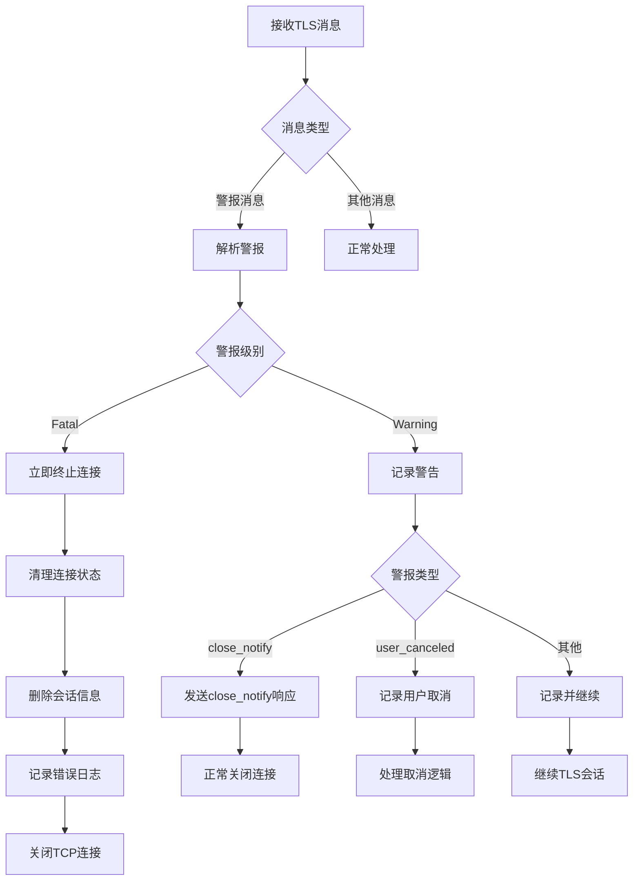
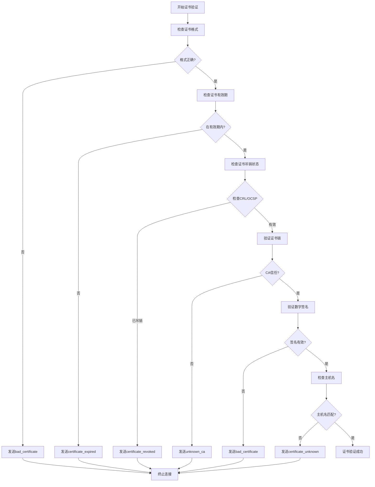

# TLS警报消息详细分析
## 基于RFC 5246 (TLS 1.2) 和 RFC 8446 (TLS 1.3) 标准规范

### 目录
1. [概述](#概述)
2. [警报消息结构](#警报消息结构)
3. [警报级别分类](#警报级别分类)
4. [TLS 1.2 警报消息](#tls-12-警报消息)
5. [TLS 1.3 警报消息](#tls-13-警报消息)
6. [警报消息流程图](#警报消息流程图)
7. [错误处理最佳实践](#错误处理最佳实践)
8. [安全考虑](#安全考虑)

---

## 概述

TLS警报消息是协议中的重要组成部分，用于通知对方发生的错误或状态变化。警报消息提供了诊断连接问题和安全威胁的重要信息。

### 警报消息的作用

1. **错误通知**: 通知对方协议错误或配置问题
2. **连接终止**: 安全地关闭TLS连接
3. **状态通信**: 传达连接状态变化
4. **安全保护**: 防止某些类型的攻击

---

## 警报消息结构

### TLS 1.2 警报消息格式

```
struct {
    AlertLevel level;
    AlertDescription description;
} Alert;

enum {
    warning(1), fatal(2), (255)
} AlertLevel;

enum {
    close_notify(0),
    unexpected_message(10),
    bad_record_mac(20),
    decryption_failed_RESERVED(21),
    record_overflow(22),
    decompression_failure(30),
    handshake_failure(40),
    no_certificate_RESERVED(41),
    bad_certificate(42),
    unsupported_certificate(43),
    certificate_revoked(44),
    certificate_expired(45),
    certificate_unknown(46),
    illegal_parameter(47),
    unknown_ca(48),
    access_denied(49),
    decode_error(50),
    decrypt_error(51),
    export_restriction_RESERVED(60),
    protocol_version(70),
    insufficient_security(71),
    internal_error(80),
    user_canceled(90),
    no_renegotiation(100),
    unsupported_extension(110),
    (255)
} AlertDescription;
```

### TLS 1.3 警报消息格式

```
struct {
    AlertLevel level;
    AlertDescription description;
} Alert;

enum {
    warning(1), fatal(2), (255)
} AlertLevel;

enum {
    close_notify(0),
    unexpected_message(10),
    bad_record_mac(20),
    record_overflow(22),
    handshake_failure(40),
    bad_certificate(42),
    unsupported_certificate(43),
    certificate_revoked(44),
    certificate_expired(45),
    certificate_unknown(46),
    illegal_parameter(47),
    unknown_ca(48),
    access_denied(49),
    decode_error(50),
    decrypt_error(51),
    protocol_version(70),
    insufficient_security(71),
    internal_error(80),
    user_canceled(90),
    missing_extension(109),
    unsupported_extension(110),
    unrecognized_name(112),
    bad_certificate_status_response(113),
    unknown_psk_identity(115),
    certificate_required(116),
    no_application_protocol(120),
    (255)
} AlertDescription;
```

---

## 警报级别分类

### Warning Level (警告级别)

**级别代码**: 1  
**处理方式**: 连接可以继续，但应记录警告

**常见警告**:
- `close_notify`: 正常连接关闭通知
- `user_canceled`: 用户取消连接
- `no_renegotiation`: 拒绝重协商请求 (仅TLS 1.2)

### Fatal Level (致命级别)

**级别代码**: 2  
**处理方式**: 必须立即终止连接

**处理规则**:
1. 接收到fatal警报后立即关闭连接
2. 不得发送更多数据
3. 删除会话标识符
4. 记录错误信息用于调试

---

## TLS 1.2 警报消息

### 常见警报消息详解

#### 1. close_notify (0)
- **级别**: Warning
- **描述**: 正常连接关闭通知
- **发送时机**: 连接正常终止时
- **处理**: 对方也应发送close_notify响应

#### 2. unexpected_message (10)
- **级别**: Fatal
- **描述**: 收到不期望的消息
- **原因**: 协议状态机错误，消息顺序不正确
- **示例**: 在握手未完成时收到应用数据

#### 3. bad_record_mac (20)
- **级别**: Fatal
- **描述**: 记录MAC验证失败
- **原因**: 
  - 密钥不匹配
  - 数据传输错误
  - 可能的中间人攻击

#### 4. decryption_failed_RESERVED (21)
- **级别**: Fatal
- **描述**: 解密失败 (已保留，不应使用)
- **安全问题**: 可能泄露有关填充的信息，导致填充攻击

#### 5. record_overflow (22)
- **级别**: Fatal
- **描述**: 记录长度超过限制
- **限制**: TLS记录最大长度为2^14字节
- **原因**: 实现错误或恶意攻击

#### 6. decompression_failure (30)
- **级别**: Fatal
- **描述**: 解压缩失败
- **注意**: TLS 1.3已移除压缩功能

#### 7. handshake_failure (40)
- **级别**: Fatal
- **描述**: 握手失败，无法协商合适的参数
- **常见原因**:
  - 没有共同支持的密码套件
  - 协议版本不兼容
  - 证书验证失败

#### 8. bad_certificate (42)
- **级别**: Fatal
- **描述**: 证书损坏或格式错误
- **检查项**:
  - ASN.1编码错误
  - 证书链不完整
  - 签名验证失败

#### 9. unsupported_certificate (43)
- **级别**: Fatal
- **描述**: 不支持的证书类型
- **示例**: 收到不支持的证书格式或算法

#### 10. certificate_revoked (44)
- **级别**: Fatal
- **描述**: 证书已被吊销
- **验证方式**: CRL或OCSP检查

#### 11. certificate_expired (45)
- **级别**: Fatal
- **描述**: 证书已过期
- **检查**: 当前时间超出证书有效期

#### 12. certificate_unknown (46)
- **级别**: Fatal
- **描述**: 证书处理中的其他问题
- **用途**: 通用证书错误

#### 13. illegal_parameter (47)
- **级别**: Fatal
- **描述**: 握手消息中的参数非法
- **示例**: 
  - 无效的密码套件
  - 错误的密钥长度
  - 不一致的扩展

#### 14. unknown_ca (48)
- **级别**: Fatal
- **描述**: 无法验证证书颁发机构
- **原因**: 证书链中的CA不在信任列表中

#### 15. access_denied (49)
- **级别**: Fatal
- **描述**: 访问被拒绝
- **场景**: 
  - 客户端证书验证失败
  - 授权检查失败

#### 16. decode_error (50)
- **级别**: Fatal
- **描述**: 消息解码错误
- **原因**: 
  - 消息格式不正确
  - 长度字段错误
  - 编码违反协议规范

#### 17. decrypt_error (51)
- **级别**: Fatal
- **描述**: 解密操作失败
- **原因**:
  - 密钥错误
  - 加密参数不匹配
  - 加密数据损坏

#### 18. protocol_version (70)
- **级别**: Fatal
- **描述**: 协议版本不支持
- **示例**: 服务器不支持客户端请求的TLS版本

#### 19. insufficient_security (71)
- **级别**: Fatal
- **描述**: 安全级别不足
- **原因**: 密码套件强度不满足安全策略

#### 20. internal_error (80)
- **级别**: Fatal
- **描述**: 内部实现错误
- **用途**: 非协议相关的实现问题

#### 21. user_canceled (90)
- **级别**: Warning
- **描述**: 用户取消操作
- **场景**: 用户主动取消连接建立

#### 22. no_renegotiation (100)
- **级别**: Warning
- **描述**: 拒绝重协商请求
- **安全**: 防止重协商攻击

#### 23. unsupported_extension (110)
- **级别**: Fatal
- **描述**: 不支持的扩展
- **处理**: 收到无法理解的关键扩展

---

## TLS 1.3 警报消息

### TLS 1.3 新增和修改的警报

#### 新增警报消息

##### 1. missing_extension (109)
- **级别**: Fatal
- **描述**: 缺少必需的扩展
- **示例**: 
  - ClientHello缺少supported_versions扩展
  - 缺少signature_algorithms扩展

##### 2. unrecognized_name (112)
- **级别**: Fatal
- **描述**: 服务器名称不被识别
- **用途**: SNI (Server Name Indication) 错误

##### 3. bad_certificate_status_response (113)
- **级别**: Fatal
- **描述**: 证书状态响应错误
- **关联**: OCSP Stapling功能

##### 4. unknown_psk_identity (115)
- **级别**: Fatal
- **描述**: 未知的PSK身份标识
- **用途**: PSK模式下身份验证失败

##### 5. certificate_required (116)
- **级别**: Fatal
- **描述**: 需要证书但未提供
- **场景**: 服务器要求客户端证书认证

##### 6. no_application_protocol (120)
- **级别**: Fatal
- **描述**: 无法协商应用层协议
- **关联**: ALPN (Application Layer Protocol Negotiation)

#### 移除的警报消息

TLS 1.3中移除的警报:
- `decryption_failed_RESERVED` (21): 安全问题
- `no_certificate_RESERVED` (41): 已废弃
- `export_restriction_RESERVED` (60): 出口限制已废除
- `decompression_failure` (30): 移除压缩功能
- `no_renegotiation` (100): 禁用重协商

---

## 警报消息流程图

### TLS警报处理流程



### 证书验证警报流程



---

## 错误处理最佳实践

### 客户端处理策略

#### 1. 警报日志记录
```python
def handle_tls_alert(alert_level, alert_description):
    """处理TLS警报消息"""
    
    alert_names = {
        0: "close_notify",
        10: "unexpected_message",
        20: "bad_record_mac",
        40: "handshake_failure",
        42: "bad_certificate",
        # ... 更多警报类型
    }
    
    alert_name = alert_names.get(alert_description, f"unknown({alert_description})")
    level_name = "WARNING" if alert_level == 1 else "FATAL"
    
    logger.log(f"TLS Alert: {level_name} - {alert_name}")
    
    if alert_level == 2:  # Fatal
        cleanup_connection()
        raise TLSFatalAlert(f"Fatal TLS alert: {alert_name}")
    elif alert_description == 0:  # close_notify
        send_close_notify()
        close_connection()
```

#### 2. 错误恢复机制
```python
def handle_handshake_failure(error_code):
    """握手失败恢复策略"""
    
    recovery_strategies = {
        40: retry_with_different_cipher_suites,
        70: retry_with_lower_protocol_version,
        71: retry_with_stronger_security,
        110: retry_without_unsupported_extensions
    }
    
    strategy = recovery_strategies.get(error_code)
    if strategy:
        return strategy()
    else:
        raise UnrecoverableHandshakeError(error_code)
```

### 服务器处理策略

#### 1. 警报发送决策
```python
def should_send_alert(error_type, client_info):
    """决定是否发送特定警报"""
    
    # 防止信息泄露
    if error_type == "certificate_validation_failed":
        if client_info.is_internal:
            return "bad_certificate"  # 内部客户端提供详细信息
        else:
            return "handshake_failure"  # 外部客户端使用通用错误
    
    # 防止时序攻击
    if error_type == "psk_not_found":
        time.sleep(random.uniform(0.1, 0.3))  # 随机延迟
        return "decrypt_error"
    
    return get_standard_alert(error_type)
```

#### 2. 速率限制和防护
```python
class AlertManager:
    def __init__(self):
        self.client_alerts = defaultdict(list)
        self.alert_thresholds = {
            "bad_certificate": 3,
            "handshake_failure": 5,
            "protocol_version": 10
        }
    
    def should_block_client(self, client_ip, alert_type):
        """基于警报频率决定是否阻止客户端"""
        
        current_time = time.time()
        # 清理过期记录
        self.client_alerts[client_ip] = [
            (ts, alert) for ts, alert in self.client_alerts[client_ip]
            if current_time - ts < 3600  # 1小时窗口
        ]
        
        # 统计特定类型警报
        alert_count = sum(
            1 for ts, alert in self.client_alerts[client_ip]
            if alert == alert_type
        )
        
        threshold = self.alert_thresholds.get(alert_type, 5)
        return alert_count >= threshold
```

---

## 安全考虑

### 信息泄露防护

#### 1. 警报消息统一化
```
目标: 防止通过不同警报消息进行信息枚举

策略:
- 对外部客户端使用通用错误消息
- 详细错误信息仅记录在服务器日志中
- 避免透露内部配置和状态信息
```

#### 2. 时序攻击防护
```
目标: 防止通过响应时间差异获取信息

措施:
- 证书验证失败使用相同响应时间
- PSK查找失败添加随机延迟
- 统一错误处理路径的执行时间
```

### 拒绝服务攻击防护

#### 1. 警报频率限制
```python
class DOSProtection:
    def __init__(self):
        self.connection_limits = {
            "per_ip": 100,           # 每IP最大连接数
            "alert_rate": 10,        # 每分钟最大警报数
            "handshake_timeout": 30   # 握手超时时间
        }
    
    def check_alert_rate(self, client_ip):
        """检查警报发送频率"""
        current_minute = int(time.time() / 60)
        key = f"{client_ip}:{current_minute}"
        
        alert_count = self.redis.incr(key)
        self.redis.expire(key, 60)
        
        if alert_count > self.connection_limits["alert_rate"]:
            self.block_client(client_ip, duration=3600)
            return False
        return True
```

#### 2. 资源限制
```python
def enforce_connection_limits():
    """强制连接限制"""
    
    limits = {
        "max_concurrent_handshakes": 1000,
        "max_handshake_memory": "100MB",
        "max_alert_buffer_size": 1024
    }
    
    # 监控和限制资源使用
    current_handshakes = get_active_handshake_count()
    if current_handshakes > limits["max_concurrent_handshakes"]:
        reject_new_connections()
    
    memory_usage = get_handshake_memory_usage()
    if memory_usage > parse_size(limits["max_handshake_memory"]):
        cleanup_oldest_handshakes()
```

### 审计和监控

#### 1. 安全事件记录
```python
def log_security_event(event_type, details):
    """记录安全相关事件"""
    
    security_logger = logging.getLogger('security')
    
    event_data = {
        "timestamp": datetime.utcnow().isoformat(),
        "event_type": event_type,
        "client_ip": details.get("client_ip"),
        "alert_level": details.get("alert_level"),
        "alert_description": details.get("alert_description"),
        "session_id": details.get("session_id"),
        "user_agent": details.get("user_agent"),
        "server_name": details.get("server_name")
    }
    
    # 结构化日志便于分析
    security_logger.warning(json.dumps(event_data))
    
    # 严重事件立即通知
    if event_type in ["repeated_handshake_failures", "certificate_attack"]:
        send_security_alert(event_data)
```

#### 2. 异常模式检测
```python
class AnomalyDetector:
    def __init__(self):
        self.baseline_metrics = {
            "normal_alert_rate": 0.01,  # 正常警报率
            "expected_cipher_suites": set([...]),
            "common_user_agents": set([...])
        }
    
    def detect_anomalies(self, recent_alerts):
        """检测异常模式"""
        
        # 检测警报率异常
        alert_rate = len(recent_alerts) / time_window
        if alert_rate > self.baseline_metrics["normal_alert_rate"] * 10:
            return "high_alert_rate"
        
        # 检测扫描行为
        unique_errors = len(set(alert["description"] for alert in recent_alerts))
        if unique_errors > 5:
            return "possible_scanning"
        
        # 检测协议降级攻击
        version_alerts = [a for a in recent_alerts if a["description"] == 70]
        if len(version_alerts) > 3:
            return "possible_downgrade_attack"
        
        return None
```

---

## 总结

TLS警报消息是协议安全机制的重要组成部分，正确理解和处理这些消息对于：

1. **调试连接问题**: 快速定位握手和连接故障
2. **安全防护**: 识别和防范各种攻击
3. **性能优化**: 通过警报分析优化配置
4. **合规要求**: 满足安全审计和监控需求

### 关键要点

- **及时响应**: Fatal级别警报需要立即终止连接
- **安全优先**: 避免通过警报消息泄露敏感信息
- **监控分析**: 建立完善的警报监控和分析机制
- **防护措施**: 实施速率限制和异常检测

正确实施TLS警报处理机制能够显著提升系统的安全性和可维护性，是构建安全通信系统的基础要求。 