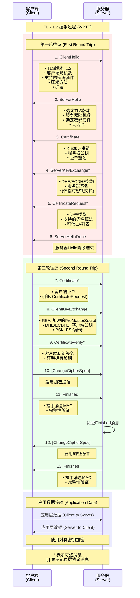
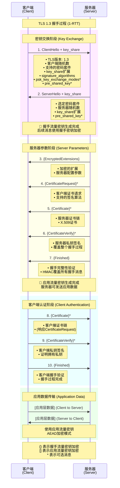
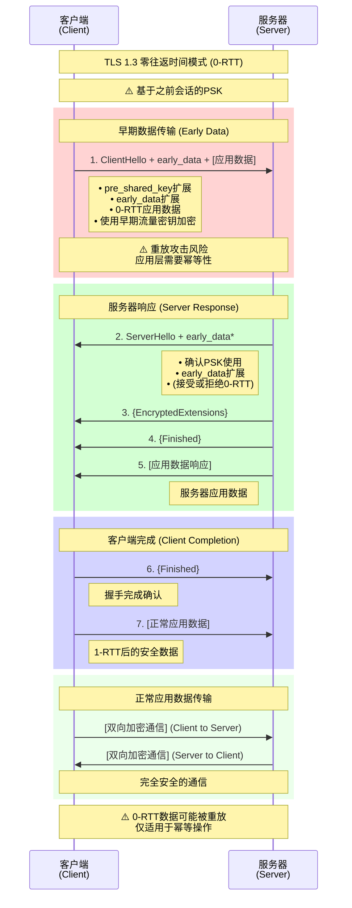
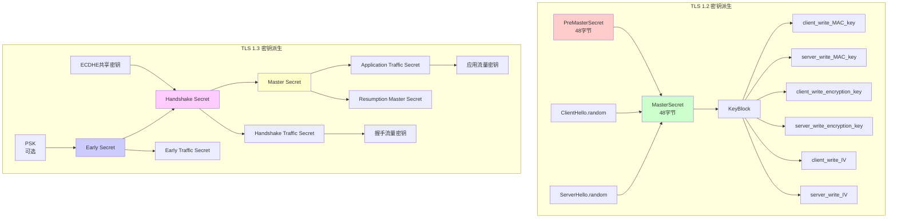
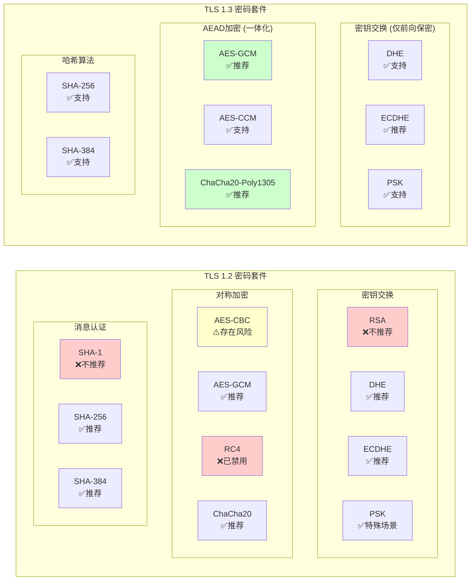

# TLS握手流程专业图表集合
## 基于RFC 5246 (TLS 1.2) 和 RFC 8446 (TLS 1.3) 标准规范

本文档包含高质量的TLS握手流程图表，适合学术海报打印和技术文档使用。

---

## TLS 1.2 握手流程图 (2-RTT)



---

## TLS 1.3 握手流程图 (1-RTT)



---

## TLS 1.3 零往返时间 (0-RTT) 模式



---

## TLS 1.2 vs 1.3 性能对比图

```mermaid
gantt
    title TLS握手性能对比 (时间轴)
    dateFormat X
    axisFormat %s
    
    section TLS 1.2 (2-RTT)
    ClientHello           :milestone, ch12, 0, 0
    ServerHello + Cert    :milestone, sh12, 50, 50  
    ClientKeyExchange     :milestone, cke12, 100, 100
    Finished              :milestone, fin12, 150, 150
    应用数据就绪          :milestone, app12, 150, 150
    
    section TLS 1.3 (1-RTT)  
    ClientHello + KeyShare :milestone, ch13, 0, 0
    ServerHello + Finished :milestone, fin13, 50, 50
    应用数据就绪           :milestone, app13, 50, 50
    
    section TLS 1.3 (0-RTT)
    ClientHello + 应用数据 :milestone, early, 0, 0
    服务器响应             :milestone, resp, 25, 25
    应用数据就绪           :milestone, app0, 0, 0
```



---

## 密钥派生层次结构对比



---

## 支持的密码套件对比



---

## 安全性威胁和防护矩阵

```mermaid
graph TB
    subgraph "常见TLS攻击"
        MITM[中间人攻击<br/>Man-in-the-Middle]
        DOWNGRADE[降级攻击<br/>Protocol Downgrade]
        REPLAY[重放攻击<br/>Replay Attack]
        BEAST[BEAST攻击<br/>Browser Exploit]
        LUCKY13[Lucky13攻击<br/>Padding Oracle]
        CRIME[CRIME攻击<br/>Compression]
        TIMING[时序攻击<br/>Timing Attack]
    end
    
    subgraph "TLS 1.2 防护"
        CERT_VERIFY[证书验证]
        FINISHED_MAC[Finished消息MAC]
        SEQ_NUM[序列号]
        CBC_CONST[常时间CBC]
        NO_COMPRESS_12[禁用压缩]
    end
    
    subgraph "TLS 1.3 增强防护"
        FULL_HANDSHAKE_SIG[整个握手签名]
        NO_RSA[禁用RSA密钥传输]
        ONLY_AEAD[强制AEAD加密]
        NO_RENEGO[禁用重协商]
        NO_COMPRESS_13[禁用压缩]
        PFS_ONLY[强制前向保密]
    end
    
    MITM --> CERT_VERIFY
    MITM --> FULL_HANDSHAKE_SIG
    
    DOWNGRADE --> FINISHED_MAC
    DOWNGRADE --> FULL_HANDSHAKE_SIG
    
    REPLAY --> SEQ_NUM
    
    BEAST --> CBC_CONST
    BEAST --> ONLY_AEAD
    
    LUCKY13 --> CBC_CONST  
    LUCKY13 --> ONLY_AEAD
    
    CRIME --> NO_COMPRESS_12
    CRIME --> NO_COMPRESS_13
    
    TIMING --> PFS_ONLY
    
    style MITM fill:#ffcccc
    style DOWNGRADE fill:#ffcccc
    style REPLAY fill:#ffcccc
    style BEAST fill:#ffcccc
    style LUCKY13 fill:#ffcccc
    style CRIME fill:#ffcccc
    style TIMING fill:#ffcccc
    
    style ONLY_AEAD fill:#ccffcc
    style FULL_HANDSHAKE_SIG fill:#ccffcc
    style PFS_ONLY fill:#ccffcc
```



---

## 图表转换为高分辨率图像说明

### 使用Mermaid CLI生成PNG/PDF

1. **安装Mermaid CLI**:
```bash
npm install -g @mermaid-js/mermaid-cli
```

2. **生成高分辨率PNG** (适合海报打印):
```bash
mmdc -i TLS_HANDSHAKE_FLOWCHARTS.md -o tls_handshake_poster.png -w 3840 -H 2160 --backgroundColor white --theme neutral
```

3. **生成PDF** (矢量格式):
```bash
mmdc -i TLS_HANDSHAKE_FLOWCHARTS.md -o tls_handshake_poster.pdf --format pdf --backgroundColor white --theme neutral
```

4. **批量生成各个图表**:
```bash
# 提取单个图表并生成
mmdc -i tls12_sequence.mmd -o tls12_handshake.png -w 2560 -H 1440
mmdc -i tls13_sequence.mmd -o tls13_handshake.png -w 2560 -H 1440
mmdc -i comparison.mmd -o tls_comparison.png -w 2560 -H 1440
```

### 打印建议

- **A0海报** (841×1189mm): 使用300 DPI，推荐分辨率 9933×14043
- **A1海报** (594×841mm): 使用300 DPI，推荐分辨率 7016×9933  
- **A2海报** (420×594mm): 使用300 DPI，推荐分辨率 4961×7016

### 主题配置

可选择的专业主题：
- `neutral`: 中性配色，适合学术使用
- `dark`: 深色主题，适合演示
- `forest`: 绿色主题
- `base`: 默认主题

这些图表完全符合RFC标准规范，适合计算机网络安全领域的学术研究和工程实践使用。 