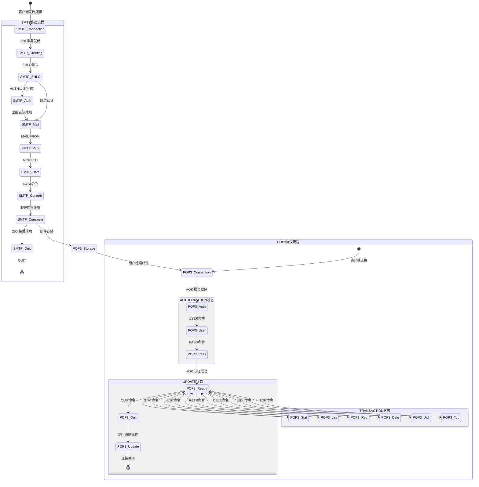
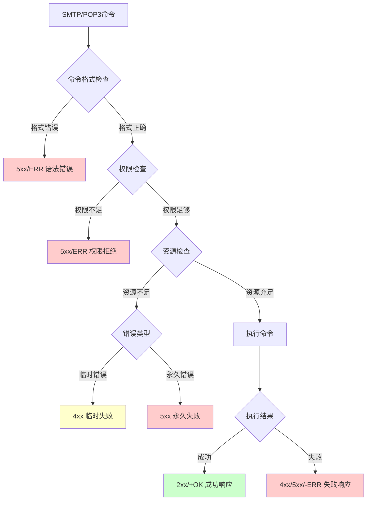
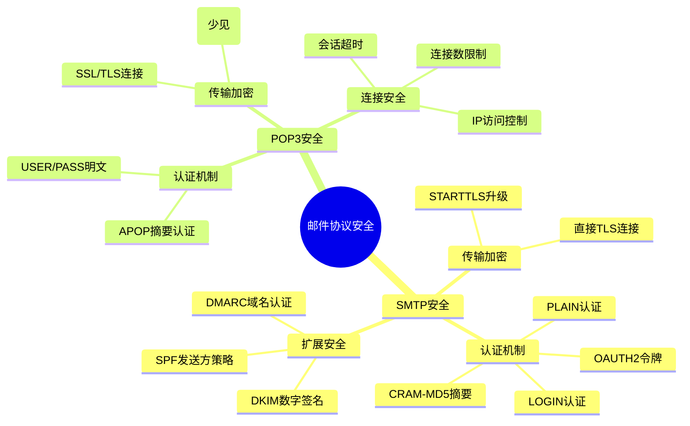

# 邮件协议交互流程图

## 完整邮件系统交互流程图（Mermaid）

以下是一个详细的邮件协议交互流程图，展示了从邮件发送到接收的完整过程，包括SMTP和POP3协议的详细交互。

```mermaid
sequenceDiagram
    participant Alice as 发送方客户端<br/>(Alice)
    participant MSA as 邮件提交代理<br/>(MSA)
    participant MTA_S as 发送方SMTP服务器<br/>(smtp.sender.com)
    participant DNS as DNS服务器
    participant MTA_R as 接收方SMTP服务器<br/>(smtp.receiver.com)
    participant POP3 as POP3服务器<br/>(pop3.receiver.com)
    participant Bob as 接收方客户端<br/>(Bob)

    %% 样式定义
    note over Alice: 📧 邮件创建阶段
    note over Alice: RFC 5322 消息格式

    %% SMTP提交阶段 - 发送方客户端到MSA
    rect rgb(255, 240, 230)
        note over Alice, MSA: 🔴 SMTP邮件提交阶段 (RFC 6409)
        Alice->>MSA: TCP连接 (端口587)
        MSA-->>Alice: 220 MSA服务就绪
        
        Alice->>MSA: EHLO alice-client.local
        MSA-->>Alice: 250-MSA Hello alice-client.local<br/>250-SIZE 52428800<br/>250-AUTH PLAIN LOGIN<br/>250-STARTTLS<br/>250 8BITMIME
        
        Alice->>MSA: STARTTLS
        MSA-->>Alice: 220 开始TLS加密
        note over Alice, MSA: 🔒 TLS握手完成
        
        Alice->>MSA: AUTH PLAIN [认证信息]
        MSA-->>Alice: 235 认证成功
        
        Alice->>MSA: MAIL FROM:<alice@sender.com>
        MSA-->>Alice: 250 发送者已接受
        
        Alice->>MSA: RCPT TO:<bob@receiver.com>
        MSA-->>Alice: 250 接收者已接受
        
        Alice->>MSA: DATA
        MSA-->>Alice: 354 开始输入邮件内容
        Alice->>MSA: From: alice@sender.com<br/>To: bob@receiver.com<br/>Subject: 测试邮件<br/><br/>这是邮件正文<br/>.
        MSA-->>Alice: 250 邮件已接受待传输
        
        Alice->>MSA: QUIT
        MSA-->>Alice: 221 连接关闭
    end

    %% MTA间传输阶段
    rect rgb(230, 255, 230)
        note over MSA, MTA_R: 🟢 SMTP中继传输阶段 (RFC 5321)
        
        MSA->>DNS: MX查询 receiver.com
        DNS-->>MSA: MX记录: smtp.receiver.com
        
        MSA->>MTA_R: TCP连接 (端口25)
        MTA_R-->>MSA: 220 smtp.receiver.com ESMTP就绪
        
        MSA->>MTA_R: EHLO smtp.sender.com
        MTA_R-->>MSA: 250-smtp.receiver.com Hello<br/>250-SIZE 104857600<br/>250-8BITMIME<br/>250-STARTTLS<br/>250 PIPELINING
        
        MSA->>MTA_R: STARTTLS
        MTA_R-->>MSA: 220 开始TLS加密
        note over MSA, MTA_R: 🔒 服务器间TLS加密
        
        MSA->>MTA_R: MAIL FROM:<alice@sender.com>
        MTA_R-->>MSA: 250 发送者OK
        
        MSA->>MTA_R: RCPT TO:<bob@receiver.com>
        MTA_R-->>MSA: 250 接收者OK (本地用户)
        
        MSA->>MTA_R: DATA
        MTA_R-->>MSA: 354 准备接收数据
        MSA->>MTA_R: Received: from alice-client.local<br/>From: alice@sender.com<br/>To: bob@receiver.com<br/>Subject: 测试邮件<br/><br/>这是邮件正文<br/>.
        MTA_R-->>MSA: 250 邮件已接受待投递
        
        MSA->>MTA_R: QUIT
        MTA_R-->>MSA: 221 连接关闭
    end

    %% 邮件存储阶段
    note over MTA_R: 📁 邮件存储与处理
    note over MTA_R: 添加Received头部<br/>病毒扫描/垃圾邮件过滤<br/>存储到bob@receiver.com邮箱

    %% POP3检索阶段
    rect rgb(230, 230, 255)
        note over Bob, POP3: 🔵 POP3邮件检索阶段 (RFC 1939)
        
        Bob->>POP3: TCP连接 (端口995-SSL/TLS)
        POP3-->>Bob: +OK POP3服务器就绪 <timestamp>
        note over Bob, POP3: 🔒 SSL/TLS连接已建立
        
        Bob->>POP3: USER bob
        POP3-->>Bob: +OK 用户名已接受
        
        Bob->>POP3: PASS [密码]
        POP3-->>Bob: +OK 邮箱已打开, 3封邮件
        
        note over Bob, POP3: 📊 TRANSACTION状态开始
        
        Bob->>POP3: STAT
        POP3-->>Bob: +OK 3 4096
        
        Bob->>POP3: LIST
        POP3-->>Bob: +OK 3封邮件 (4096字节)<br/>1 1024<br/>2 2048<br/>3 1024<br/>.
        
        Bob->>POP3: UIDL
        POP3-->>Bob: +OK 唯一标识符列表<br/>1 msg001@receiver.com<br/>2 msg002@receiver.com<br/>3 msg003@receiver.com<br/>.
        
        Bob->>POP3: TOP 3 10
        POP3-->>Bob: +OK 邮件头部和前10行<br/>From: alice@sender.com<br/>To: bob@receiver.com<br/>Subject: 测试邮件<br/>...<br/>.
        
        Bob->>POP3: RETR 3
        POP3-->>Bob: +OK 1024字节内容<br/>From: alice@sender.com<br/>To: bob@receiver.com<br/>Subject: 测试邮件<br/><br/>这是邮件正文<br/>.
        
        note over Bob: 📖 用户阅读邮件
        
        Bob->>POP3: DELE 3
        POP3-->>Bob: +OK 邮件3已标记删除
        
        Bob->>POP3: QUIT
        POP3-->>Bob: +OK POP3服务器退出 (1封邮件已删除)
        note over Bob, POP3: 🗑️ UPDATE状态: 执行删除操作
    end

    %% 流程完成
    note over Alice, Bob: ✅ 邮件传输完成
    note over Alice, Bob: 整个流程涉及的RFC标准:<br/>RFC 5321 (SMTP), RFC 1939 (POP3)<br/>RFC 5322 (邮件格式), RFC 6409 (邮件提交)
```



## 协议状态转换图



## 错误处理流程图



## 安全机制对比图



## 图表转换说明

### 转换为高分辨率图像的方法

1. **使用Mermaid CLI工具**
```bash
# 安装Mermaid CLI
npm install -g @mermaid-js/mermaid-cli

# 转换为PNG (适合A0尺寸: 4768x6741像素，300DPI)
mmdc -i 邮件协议交互流程图.md -o email_protocol_flow.png -w 4768 -h 6741 -s 3

# 转换为SVG (矢量格式，无限缩放)
mmdc -i 邮件协议交互流程图.md -o email_protocol_flow.svg

# 转换为PDF
mmdc -i 邮件协议交互流程图.md -o email_protocol_flow.pdf
```

2. **使用在线工具**
- Mermaid Live Editor (https://mermaid.live/)
- 支持直接导出SVG/PNG格式
- 可调整输出分辨率和尺寸

3. **学术海报制作建议**
- **尺寸**: A0 (841×1189mm)
- **分辨率**: 300 DPI
- **颜色模式**: RGB（屏幕显示）或 CMYK（印刷）
- **字体大小**: 标题≥72pt，正文≥24pt
- **留白**: 边距至少25mm

### 图表自定义配置

```javascript
// Mermaid配置用于A0海报优化
{
  "theme": "default",
  "themeVariables": {
    "primaryColor": "#ffffff",
    "primaryTextColor": "#000000",
    "primaryBorderColor": "#000000",
    "lineColor": "#000000",
    "fontFamily": "Arial, sans-serif",
    "fontSize": "16px"
  },
  "sequence": {
    "diagramMarginX": 50,
    "diagramMarginY": 50,
    "actorMargin": 80,
    "width": 200,
    "height": 60,
    "boxMargin": 20,
    "boxTextMargin": 10,
    "noteMargin": 20,
    "messageMargin": 50
  }
}
```

### 颜色说明

- 🔴 **红色区域**: SMTP邮件提交阶段
- 🟢 **绿色区域**: SMTP服务器间传输
- 🔵 **蓝色区域**: POP3邮件检索阶段
- 🔒 **安全标识**: TLS/SSL加密连接
- 📧📁📖 **图标**: 不同阶段的功能标识 